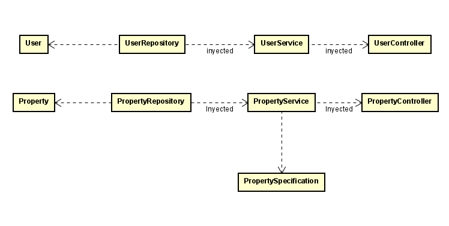

# Spring Server
This repository contains an example of how to build a web server using Spring. It covers the complete process of creating the model, repository, service, and controller, as well as an additional class for filtering data during fetching. The project uses a MySQL database to persist data and is deployed to run in the cloud with AWS.

Additionally, a secure connection was implemented using Let's Encrypt certificates, enabling HTTPS requests to the pages. Furthermore, the deployment includes an Apache web server to provide a complete service.

## Getting Started

This project is built in Java using Maven. Additional Spring Boot dependencies, such as Spring Web and JPA, are included in the pom.xml file.

Important: This server requires a properly configured database to function. The database is set up in the docker-compose file, so use this as a reference to modify users or other aspects as needed.

### Prerequisites

Before running this project, ensure you have the following installed on your system:

* Docker
    
### Installing

Follow these steps to set up and run the project in your local development environment:

Clone the Repository:

```
git clone https://github.com/MateoSebF/Taller6_AREP

```

Navigate to the Project Directory:

```
cd Taller6_AREP
```

Build the Project with Docker:


### Architecture
To understand the architecture followed in this article, we are going to use a diagram like this:



In this architecture, we extend the structure of Lab5_AREP with the login system by defining the interaction between key components to ensure secure authentication. The design consists of four main components:

User: This is the model class where we define user-related attributes, such as id, email, and password. It is annotated with @Entity, indicating that it represents a table in the database.

UserRepository: This interface extends JpaRepository and allows interaction with the database, enabling operations such as saving, deleting, and retrieving user data. It is annotated with @Repository, making it injectable into the UserService.

UserService: This class contains the business logic for user authentication and management. It handles operations like user registration, password encoding, and authentication validation. It interacts with UserRepository to fetch or update user data securely.

UserController: This class serves as the entry point for authentication-related operations. It is annotated with @RestController and exposes endpoints such as /auth/register and /auth/login. The controller processes authentication requests, validates user credentials, and returns appropriate responses, such as JWT tokens for secure session management.

This architecture ensures a clear separation of concerns, making the system maintainable and scalable. Security measures, such as password hashing using BCryptPasswordEncoder.

# Deployment
To deploy this project, we use a Docker-based solution on AWS, ensuring a secure and scalable setup.

## AWS Deployment
To deploy the application on AWS, we performed the following steps:

1. Created two EC2 instances—one for the backend and one for the frontend.
2. Configured security rules to allow inbound traffic on the required ports:
    - 80 and 443 for HTTPS access.
    - 3306 for MySQL (restricted access).
3. Assigned an Elastic IP to each instance to ensure a static address.
4. Configured a custom domain using Duck DNS, associating it with the Elastic IPs.
5. Installed Let's Encrypt and Certbot on both instances to generate SSL certificates, enabling secure HTTPS connections for both the frontend and backend.

## Backend Deployment
1. Installed Git and Docker on the EC2 instance.

2. Cloned the repository and navigated to the backend folder.

3. Ran the following command to build and start the backend and database containers:

```
docker-compose up --build -d
```

4. This command builds the backend image and deploys both the backend and MySQL containers.
5. The application now runs securely with HTTPS, as seen in the deployment demo.

## Frontend Deployment
1. Installed Git and Docker on the frontend EC2 instance.

2. Cloned the repository and navigated to the frontend folder.

3. Built the frontend Docker image using:

```
docker build -t frontend-app .
```
4. Ran the frontend container using:

```
docker run -d -p 80:80 -p 443:443 --name frontend-container frontend-app
```
5. The frontend is now accessible via the configured Duck DNS domain over HTTPS.

### Link to Deployment Demo Demostration 

[Watch the deployment in action](https://pruebacorreoescuelaingeduco.sharepoint.com/sites/Reco842/Shared%20Documents/General/Recordings/Reuni%C3%B3n%20en%20_General_-20250314_011913-Grabaci%C3%B3n%20de%20la%20reuni%C3%B3n.mp4?web=1&referrer=Teams.TEAMS-WEB&referrerScenario=MeetingChicletGetLink.view)  


## Built With

* [Java](https://www.oracle.com/co/java/technologies/downloads/) - The programming language used
* [Maven](https://maven.apache.org/) - Dependency Management
* [JUnit](https://junit.org/junit5/) - Testing Framework for unit tests

## Versioning

We use [Conventional Commits](https://www.conventionalcommits.org/en/v1.0.0/) for versioning.  

## Authors

**Mateo Forero** - *Initial work* - [MateoSebF](https://github.com/MateoSebF)

## Acknowledgments

* Inspiration from various resources and tutorials